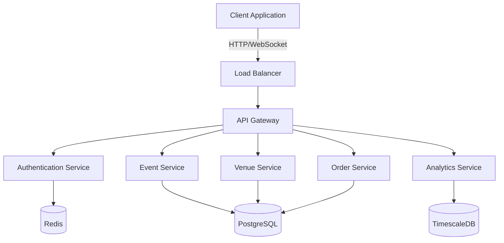

# ArenaPulse Technical Specification
## Real-time Stadium Experience Platform

### Table of Contents
- [1. System Architecture](#1-system-architecture)
- [2. Core Features](#2-core-features)
- [3. Database Schema](#3-database-schema)
- [4. Integration Points](#4-integration-points)
- [5. Security Framework](#5-security-framework)
- [6. Performance Requirements](#6-performance-requirements)
- [7. Implementation Roadmap](#7-implementation-roadmap)

## 1. System Architecture

### Technology Stack

#### Frontend
- **Framework**: React 18 with TypeScript
- **State Management**: TanStack Query (React Query) for server state, Zustand for client state
- **Real-time Communication**: WebSocket with Socket.IO client
- **UI Components**: Tailwind CSS with custom components
- **Build Tool**: Vite
- **Testing**: Vitest, React Testing Library

#### Backend
- **Runtime**: Node.js with TypeScript
- **API Framework**: Fastify
- **Real-time Server**: Socket.IO
- **ORM**: Prisma
- **Database**: PostgreSQL with TimescaleDB extension for time-series data
- **Cache**: Redis for session management and real-time data
- **Search**: Elasticsearch for venue and event search
- **Message Queue**: Redis Pub/Sub for real-time events

### System Components



### Infrastructure
- **Hosting**: AWS
- **Containerization**: Docker with Kubernetes
- **CDN**: CloudFront for static assets
- **Media Storage**: S3 for user-generated content
- **Monitoring**: Datadog with custom metrics

## 2. Core Features

### User Management

#### Authentication Endpoints

```typescript
// POST /api/v1/auth/register
interface RegisterRequest {
  email: string;
  password: string;
  fullName: string;
  phoneNumber?: string;
}

interface RegisterResponse {
  userId: string;
  token: string;
  expiresAt: string;
}

// POST /api/v1/auth/login
interface LoginRequest {
  email: string;
  password: string;
}

interface LoginResponse {
  token: string;
  expiresAt: string;
  user: UserProfile;
}
```

### Event Management

#### Real-time Event Updates

```typescript
interface EventUpdate {
  eventId: string;
  type: 'CAPACITY' | 'STATUS' | 'PRICE';
  data: {
    currentCapacity?: number;
    status?: EventStatus;
    price?: PriceUpdate;
  };
  timestamp: string;
}

// WebSocket Events
const eventUpdates = {
  'event:update': (data: EventUpdate) => void;
  'event:capacity': (data: CapacityUpdate) => void;
};
```

### Order Processing

```typescript
// POST /api/v1/orders
interface CreateOrderRequest {
  eventId: string;
  tickets: {
    sectionId: string;
    quantity: number;
    priceLevel: string;
  }[];
  paymentMethod: PaymentMethod;
}

interface OrderResponse {
  orderId: string;
  status: OrderStatus;
  total: number;
  tickets: TicketDetails[];
  paymentStatus: PaymentStatus;
}
```

## 3. Database Schema

### Core Tables

```sql
-- Users table
CREATE TABLE users (
  id UUID PRIMARY KEY DEFAULT gen_random_uuid(),
  email TEXT UNIQUE NOT NULL,
  password_hash TEXT NOT NULL,
  full_name TEXT NOT NULL,
  phone_number TEXT,
  created_at TIMESTAMPTZ DEFAULT NOW(),
  updated_at TIMESTAMPTZ DEFAULT NOW()
);

-- Venues table
CREATE TABLE venues (
  id UUID PRIMARY KEY DEFAULT gen_random_uuid(),
  name TEXT NOT NULL,
  location JSONB NOT NULL,
  capacity INTEGER NOT NULL,
  sections JSONB NOT NULL,
  amenities TEXT[],
  created_at TIMESTAMPTZ DEFAULT NOW()
);

-- Events table
CREATE TABLE events (
  id UUID PRIMARY KEY DEFAULT gen_random_uuid(),
  venue_id UUID REFERENCES venues(id),
  name TEXT NOT NULL,
  start_time TIMESTAMPTZ NOT NULL,
  end_time TIMESTAMPTZ NOT NULL,
  status event_status NOT NULL,
  capacity_config JSONB NOT NULL,
  pricing_tiers JSONB NOT NULL,
  created_at TIMESTAMPTZ DEFAULT NOW()
);
```

### Indexes and Optimization

```sql
-- Indexes for frequent queries
CREATE INDEX idx_events_venue_id ON events(venue_id);
CREATE INDEX idx_events_start_time ON events(start_time);
CREATE INDEX idx_users_email ON users(email);

-- Full-text search for venues
CREATE INDEX idx_venues_name_fts ON venues USING gin(to_tsvector('english', name));
```

### Caching Strategy
- Redis cache layers:
  - Session data (TTL: 24 hours)
  - Event capacity (TTL: 1 minute)
  - Venue details (TTL: 1 hour)
  - User preferences (TTL: 12 hours)

## 4. Integration Points

### Payment Processing
- Integration with Stripe
- Webhook endpoints for payment status updates
- Automatic retry mechanism for failed payments

```typescript
interface StripeWebhookPayload {
  type: string;
  data: {
    object: {
      id: string;
      status: string;
      amount: number;
      metadata: {
        orderId: string;
      };
    };
  };
}
```

### Email Service
- Integration with SendGrid
- Transactional email templates
- Email delivery status tracking

### SMS Notifications
- Integration with Twilio
- Template-based messaging system
- Delivery status tracking

## 5. Security Framework

### Authentication
- JWT-based authentication
- Refresh token rotation
- Rate limiting on auth endpoints
- Multi-factor authentication support

### Data Encryption
- At-rest encryption using AES-256
- TLS 1.3 for all API communications
- Field-level encryption for sensitive data

### API Security
- Rate limiting per endpoint
- Request signing for sensitive operations
- Input validation and sanitization
- CORS policy configuration

## 6. Performance Requirements

### Response Times
- API endpoints: < 200ms (95th percentile)
- WebSocket messages: < 100ms latency
- Search operations: < 500ms

### Scalability
- Support for 100,000 concurrent users
- Horizontal scaling capability
- Auto-scaling based on load metrics

### Data Throughput
- Handle 1000 transactions per second
- Support 10,000 WebSocket connections
- Process 100GB of analytics data per day

## 7. Implementation Roadmap

### Phase 1: Foundation (Weeks 1-4)
- Basic user authentication
- Venue management
- Event creation and management
- Database setup and optimization

### Phase 2: Core Features (Weeks 5-8)
- Ticket purchasing flow
- Real-time capacity updates
- Payment processing
- Email notifications

### Phase 3: Enhanced Features (Weeks 9-12)
- Analytics dashboard
- Advanced search capabilities
- Mobile app support
- Performance optimization

### Phase 4: Scale & Polish (Weeks 13-16)
- Load testing and optimization
- Security auditing
- Documentation
- Beta testing

### Testing Requirements
- Unit test coverage > 80%
- Integration test suite for critical paths
- Load testing scenarios
- Security penetration testing

### Deployment Strategy
- Blue-green deployment
- Automated rollback capability
- Feature flags for gradual rollout
- Monitoring and alerting setup

## Appendix

### Error Codes

```typescript
enum ErrorCodes {
  AUTH_INVALID_CREDENTIALS = 'AUTH001',
  AUTH_TOKEN_EXPIRED = 'AUTH002',
  EVENT_NOT_FOUND = 'EVENT001',
  EVENT_CAPACITY_EXCEEDED = 'EVENT002',
  PAYMENT_FAILED = 'PAY001',
  SYSTEM_ERROR = 'SYS001'
}
```

### API Response Format

```typescript
interface APIResponse<T> {
  success: boolean;
  data?: T;
  error?: {
    code: string;
    message: string;
    details?: unknown;
  };
  meta?: {
    page?: number;
    limit?: number;
    total?: number;
  };
}
```